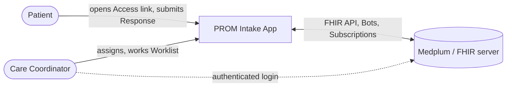

# PROM Intake

Clinical PROM triage built on **Medplum/FHIR**. Care Coordinators assign standardized patient
questionnaires (PHQ-9 first); patients complete them through secure, account-less links; every
submission is scored automatically the moment it arrives; high-risk answers raise Flags; and
coordinators work a single, priority-ordered Worklist - instead of an unread pile of paper forms.

**The flow:** assign -> complete -> score -> flag -> worklist -> resolve.



## Highlights

- **FHIR-idiomatic clinical modeling.** Instruments are `Questionnaire`s (with SDC `itemWeight`
  scoring), Responses are `QuestionnaireResponse`s, Scores are `Observation`s, and Assignments and
  Flags are `Task`s with explicit modeling conventions
  ([ADR-0001](docs/adr/0001-assignment-as-fhir-task.md),
  [ADR-0002](docs/adr/0002-flag-as-fhir-task.md),
  [ADR-0003](docs/adr/0003-task-modeling-conventions.md)).
- **A generic, config-driven PROM engine.** Scoring, severity bands, and trigger rules (including
  the acute-risk item) are Instrument *configuration*, not code - onboarding another instrument
  changes no engine internals ([ADR-0004](docs/adr/0004-scoring-and-trigger-engine.md)).
- **Account-less patient access, carefully bounded.** Patients reach exactly one questionnaire via
  a hashed, single-use, expiring token. The only unauthenticated entry point is one webhook Bot
  whose least-privilege `AccessPolicy` can create a single response and nothing else - no PHI
  reads, ever ([ADR-0005](docs/adr/0005-access-link-security-model.md)).
- **Bots + Subscriptions pipeline.** Submission validates and consumes the token atomically; a
  Subscription-fired scoring Bot persists the Score and raises Flags idempotently under
  at-least-once delivery ([ADR-0009](docs/adr/0009-bots-as-adapters-over-shared-domain-logic.md)).
- **Safety boundary as a first-class design concern.** The patient-facing Crisis Response fires
  client-side the instant an acute-risk item is answered; the clinical Flag is raised server-side
  on submission. Two independent mechanisms, deliberately allowed to diverge.
- **Real Medplum in CI - never a mocked FHIR server.** Integration tests provision a throwaway
  Medplum project inside GitHub Actions, so there is no stored secret and no mock drift
  ([ADR-0008](docs/adr/0008-integration-tests-against-real-medplum.md)).
- **Enforced deep-module boundaries.** Packages are imported only through their entry points;
  dependency-cruiser fails the build on violations (`npm run lint:boundaries`).
- **Spec-driven, AI-assisted development.** Every PR traces back to a reviewed spec issue through
  vertical-slice tickets; hard decisions live in 11 [ADRs](docs/adr/); the whole process is
  documented in the [Operating Manual](docs/workflows/OPERATING_MANUAL.md) and executed with AI
  agents as a first-class part of the workflow.

PROM Intake is a portfolio project, and says so openly
([`docs/project/portfolio-goals.md`](docs/project/portfolio-goals.md)) - but it is designed,
documented, and reviewed as if for a real care organization, because doing so is the demonstration.

## Live demo

> **Public demo - synthetic data only. Do not enter real health information.**
> Every screen carries that banner, and every patient in it is fictional. The environment is open to
> anyone with this link: treat anything you type as public.

**Coordinator app: <https://app.34.22.165.117.sslip.io/>**

| | |
| --- | --- |
| Sign in with | `coordinator@prom-intake.demo` / `PromIntakeDemo2026!` |
| Patient completion page | Not browsable on its own - it opens only through an **Access link** you generate in step 1 below (that is the point: patients need no account, and a link reaches exactly one questionnaire) |

Walk the whole product in three steps:

1. **Assign.** Sign in, open the **Assign** tab, search for `Demo` and pick one of the seeded
   synthetic patients (`Demo Patientone`, `Demo Patienttwo`, `Demo Patientthree`), then
   **Assign PHQ-9**. Copy the single-use Access link that appears.
2. **Complete.** Open that link (a private window works well - the patient page holds no session).
   Answer the PHQ-9 and submit. Answer **Item 9** positively to see the **Crisis Response** appear
   immediately, client-side, before you submit anything.
3. **Work the Flag.** Back in the coordinator's **Worklist**, the scored submission has raised a
   Flag. Open it to see the Score and the reasons that fired, **Acknowledge** it to claim it, then
   **Resolve** it with a structured reason. Use **Patient history** to see the assessment in context.

A few things worth knowing:

- **The demo resets on every deployment.** Each merge to `main` expunges the whole demo project and
  rebuilds it from the seeded baseline, so anything you create disappears on the next release
  ([ADR-0012](docs/adr/0012-gcp-public-demo-deployment.md)). That is deliberate for a public demo and
  wrong for anything real.
- **The published login is a plain project member**, not the server's super admin - it can do a Care
  Coordinator's job and nothing more. The super-admin credentials are generated, kept in Actions
  secrets, and appear nowhere public.
- **It is time-boxed.** The environment runs on free GCP credits; when they lapse it is torn down
  (`terraform destroy`) and this section is replaced with captured evidence. The infrastructure,
  pipeline, and docs stay in the repo either way.

How it is built and deployed: [`docs/architecture/infrastructure.md`](docs/architecture/infrastructure.md)
(one GCE VM, Caddy, sslip.io HTTPS) and [`docs/architecture/cicd.md`](docs/architecture/cicd.md)
(keyless CD over Workload Identity Federation).

## Documentation map

| What | Where |
| ---- | ----- |
| Product - WHAT & WHY | [`docs/product/`](docs/product/) |
| Architecture - HOW | [`docs/architecture/`](docs/architecture/) (start with the [overview](docs/architecture/overview.md)) |
| Decisions | [`docs/adr/`](docs/adr/) |
| Domain glossary | [`CONTEXT.md`](CONTEXT.md) |
| Process | [`docs/workflows/OPERATING_MANUAL.md`](docs/workflows/OPERATING_MANUAL.md) |

## Prerequisites

- Node.js >= 20 (repo developed on 22/24)
- Docker (for the local Medplum used by integration tests)

## Setup

```bash
npm ci
```

## Everyday commands

| Command | What it does |
| ------- | ------------ |
| `npm run typecheck` | TypeScript, no emit |
| `npm run lint` | ESLint |
| `npm run lint:boundaries` | dependency-cruiser deep-module boundaries |
| `npm run format` / `format:check` | Prettier (code files) |
| `npm run test:unit` | unit tests (pure, off-server) |
| `npm run test:integration` | integration tests (real Medplum) |
| `npm test` | both suites |
| `npm run check` | typecheck + lint + boundaries + tests |

## Run the whole app locally

One command brings up the **complete** local environment for the end-to-end workflow -
assign -> complete -> score -> flag -> worklist -> resolve - with everything in a single Medplum
project (so the coordinator login sees the seeded PHQ-9 and the Flags the Scoring Bot raises):

```bash
npm ci
npm run dev:full            # reuse a live project if there is one
npm run dev:full -- --fresh # force a brand-new project
```

`dev:full` starts the Docker Medplum stack, provisions (or reuses) a unified local project with
**both** a coordinator login and client credentials, seeds the baseline (PHQ-9 + the same synthetic
patients the public demo carries), deploys both Bots + the Subscription, then runs the coordinator
(http://localhost:3000) and patient (http://localhost:3001) dev servers. It prints the coordinator
sign-in credentials (also written to `.dev-user.json`). Then:

1. Sign in to the coordinator, open **Assign**, search for `Demo` to pick a seeded synthetic patient
   (or create your own), **Assign PHQ-9**, copy the Access link.
2. Open the link (patient app), answer the PHQ-9, submit.
3. Back in the coordinator **Worklist**, the Flag appears; open it to claim and resolve.

Stop the apps with Ctrl-C (Medplum keeps running). Tear everything down with:

```bash
docker compose -f infra/medplum/docker-compose.yml down -v
```

Requires Docker running and a browser to drive the UI. See
[`docs/architecture/infrastructure.md`](docs/architecture/infrastructure.md) for how the single-project
provisioning works.

## Integration tests (real Medplum)

Integration points run against a **real Medplum test project**, never a mock
([ADR-0008](docs/adr/0008-integration-tests-against-real-medplum.md)):

```bash
docker compose -f infra/medplum/docker-compose.yml up -d --wait
npm run medplum:provision        # registers a project, writes .env
npm run test:integration
docker compose -f infra/medplum/docker-compose.yml down -v
```

Without credentials the integration suite skips loudly (so `npm test` still passes on a box with no
Medplum). Full details: [`docs/architecture/infrastructure.md`](docs/architecture/infrastructure.md).

## Project layout

- `src/packages/<name>/` - deep modules (import only via entry points; see
  [`src/packages/README.md`](src/packages/README.md)).
- `src/apps/` - the two credential-isolated React apps (coordinator + patient).
- `scripts/` - operational scripts (e.g. Medplum provisioning).
- `infra/medplum/` - local Medplum compose stack.
- `docs/` - product, architecture, ADRs, specs, workflows.
