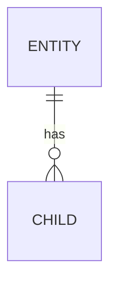

# Data Model

**Status:** TBD - fill as entities are designed.

## Stores
_Which datastore(s), and what each owns._

## Entities
_Core entities and relationships. Use `CONTEXT.md` terms for names._

## Ownership & access
_Which module owns which table/collection; no cross-module direct reads._

## Migrations
_Tooling and forward/rollback policy._
