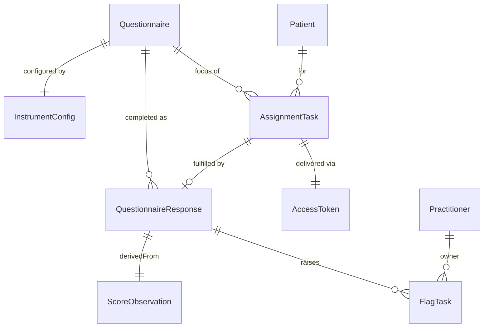

# Data Model

**Status:** Accepted (v1) - 2026-07-13. Names use [CONTEXT.md](../../CONTEXT.md) terms; resource
choices are recorded in [`docs/adr/`](../adr/).

## Stores

A single store: the **Medplum FHIR server**. Everything - clinical data, workflow state, and the
Access-link token - lives as FHIR resources in one Medplum project. This keeps one source of truth
and one audit trail (Medplum versions every resource), and keeps every product KPI computable from
app data (NFR-1). No second datastore in v1 ([ADR-0005](../adr/0005-access-link-security-model.md),
[ADR-0008](../adr/0008-integration-tests-against-real-medplum.md)).

## Entities

### Resource mapping

| Domain concept | FHIR resource | Key fields |
| -------------- | ------------- | ---------- |
| **Instrument** | `Questionnaire` | items with unique `linkId`; answer options carry SDC **`itemWeight`**; total-score LOINC coding |
| Instrument config | project-owned **`InstrumentConfig`** | severity bands + cutoffs; Trigger definitions; total/panel LOINC codes; **acute-risk item identity** (which `linkId`, if any, drives the client Crisis Response - client-readable so FR-15 stays config-driven, not hard-coded) |
| **Response** | `QuestionnaireResponse` | `subject`->Patient; links Questionnaire canonical; **source of truth for all item answers** |
| **Score** | `Observation` | LOINC **`44261-6`** (total, quantitative); `derivedFrom`->QR; `subject`->Patient |
| **Assignment** | `Task` `code=assignment` | `focus`->Questionnaire; `for`->Patient; `restriction.period.end`=deadline; `status`+`businessStatus` = Pending/Completed/Expired |
| **Flag** | `Task` `code=flag` | `owner` (single); `priority`; `focus`->Observation/QR; `businessStatus`=Open/Acknowledged/Resolved; `note`; resolution reason; **lifecycle transition timestamps** (see below) |
| **Access link** | project-owned token resource | `tokenHash` (never raw); binding->Assignment/Patient/Questionnaire; status; expiry; audit (issued/opened/submitted/expired/invalid) |
| **Crisis Response** | none | client-side only (FR-15) |

### Project-owned CodeSystems ([ADR-0003](../adr/0003-task-modeling-conventions.md))

- **Task type** (`.../CodeSystem/task-code`): `assignment`, `flag` - the `Task.code` discriminator.
- **Flag status** (`.../CodeSystem/flag-status`): `Open`, `Acknowledged`, `Resolved` - the Flag
  `businessStatus`.
- **Assignment status** (`.../CodeSystem/assignment-status`): `Pending`, `Completed`, `Expired`.
- **Resolution reason** (`.../CodeSystem/resolution-reason`): the predefined FR-28 enum (exact
  values finalized at feature-spec time).
- `status`/`businessStatus` mapping table: see [ADR-0003](../adr/0003-task-modeling-conventions.md).

### Score Observation shape (v1: total only)

v1 writes **one total-score `Observation`** (LOINC `44261-6`), not per-item or panel Observations.
Item-level answers already live durably and queryably in the `QuestionnaireResponse`; per-item
Observations would duplicate that data with no v1 consumer (Triggers read answers in the Bot at
evaluation time). Every v1 KPI is computable from total-score Observations + Task records + QRs
(NFR-1). Panel (`44249-1`) and item-level Observations are an **additive** change behind the Scoring
engine's `ObservationEmitter`, to be introduced only when a concrete metric/interoperability need
justifies them. _(Additive + reversible, so no standalone ADR - recorded here.)_

### Flag lifecycle timestamps (KPI-computable, NFR-1/NFR-6)

Two KPIs need the *time of each Flag transition*: time-to-acknowledge (Open -> Acknowledged) and
time-to-resolve (Open -> Resolved). These are recorded **first-class**, not reconstructed from
resource version history:

- **Created (Open):** `Task.authoredOn`.
- **Acknowledged:** `Task.executionPeriod.start` (set when a coordinator claims the Flag).
- **Resolved:** `Task.executionPeriod.end`.
- **Full audit (NFR-6):** each transition also writes a `Provenance` recording actor + timestamp
  (and the Resolution reason on resolve), so "how was this risk handled" is answerable from data
  without version-history archaeology.

This keeps every KPI in [`goals-and-metrics.md`](../product/goals-and-metrics.md) computable by
plain query (NFR-1).

## Ownership & access

Each module owns its resource type through its interface (see
[`module-boundaries.md`](module-boundaries.md)); no module reads another's resources directly. In
v1 all Care Coordinators see all Flags/patients within the single organization (multi-tenancy and
intra-org access scoping are out of scope / deferred). The `publicWebhook` submit Bot runs under a
narrow `AccessPolicy` scoped to create `QuestionnaireResponse` only.

## Migrations

FHIR resources are schema-flexible; the migration surface in v1 is the project-owned
`InstrumentConfig` and CodeSystems (reference/config data) plus Questionnaire/AccessPolicy
definitions. Medplum retains version history; no hard deletes (FR-30, NFR-6). Tooling and
forward/rollback policy are settled at the first-code milestone.
