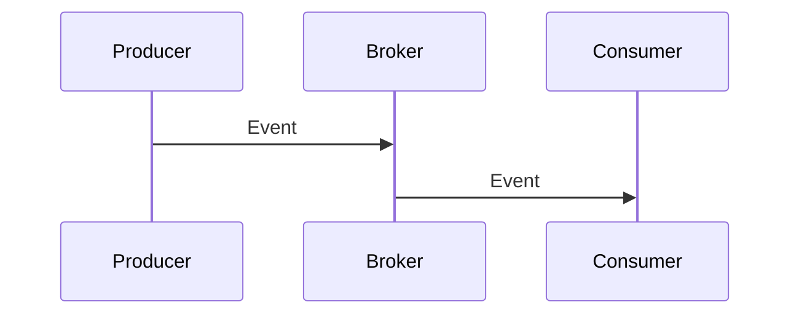

# Event / Async Flows

**Status:** TBD - fill if/when async processing is introduced.

## Transport
_Queue / broker / stream, and delivery guarantees (at-least-once, ordering, etc.)._

## Events
| Event | Producer | Consumers | Payload (schema link) |
| ----- | -------- | --------- | --------------------- |

## Idempotency & retries
_How consumers stay correct under redelivery._

