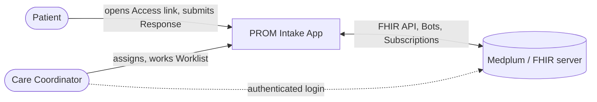
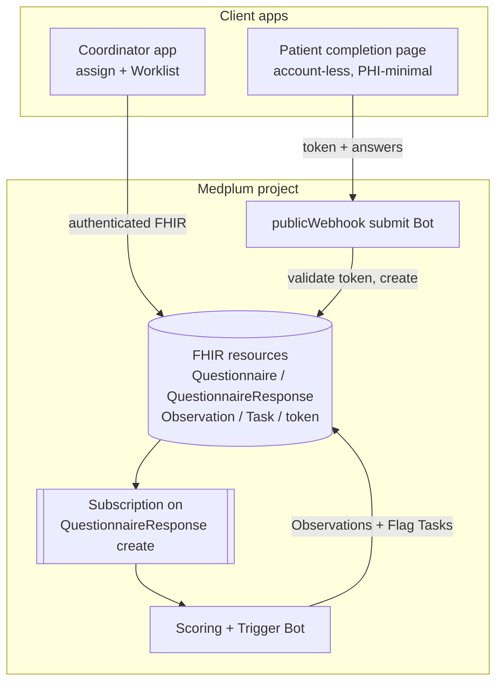

# Architecture Overview

**Status:** Accepted (v1 tracer bullet) - 2026-07-13. Decisions recorded in [`docs/adr/`](../adr/);
resource research in [`docs/research/medplum-prom-architecture.md`](../research/medplum-prom-architecture.md).

The PROM Intake platform is built on **Medplum/FHIR**. A Care Coordinator assigns an Instrument to a
patient; the patient completes it via an account-less Access link; on submission a server-side Bot
scores the Response and evaluates Triggers, raising Flags onto a prioritized Worklist that
coordinators work to resolution. The design goal is **idiomatic Medplum**, clean domain seams, and
"add a new Instrument = configuration, not an engine change" (FR-4, NFR-2).

## System context (C4 L1)

- **Patient** - source of data; account-less, reaches exactly one Instrument via a tokenized Access
  link ([ADR-0005](../adr/0005-access-link-security-model.md)).
- **Care Coordinator** - primary user; authenticated via Medplum's built-in auth (FR-31); assigns
  Instruments and works the shared Worklist.
- **Medplum** - the FHIR server, Bot runtime, and Subscription engine. A core dependency, not an
  incidental datastore.

## Container view (C4 L2)

## Tech stack

| Layer | Choice | Justification |
| ----- | ------ | ------------- |
| Clinical data platform | **Medplum** (FHIR R4) | Portfolio target; provides FHIR store, auth, Bots, Subscriptions. Core dependency ([ADR-0008](../adr/0008-integration-tests-against-real-medplum.md)). |
| Server-side logic | **Medplum Bots** (TypeScript) | Idiomatic execution primitive for scoring + triggers ([ADR-0004](../adr/0004-scoring-and-trigger-engine.md)). |
| Async trigger | **Medplum Subscription** on `QuestionnaireResponse` | Documented wiring to invoke a Bot on submit. |
| Instrument definition | **`Questionnaire`** + SDC `itemWeight` | Standard PROM template; scoring weights carried on the form. |
| Product config | project-owned **`InstrumentConfig`** | Triggers + severity bands where FHIR/SDC is silent. |
| Client | **Vite + React + `@medplum/react`** SPAs | Two credential-isolated bundles (Coordinator app + Patient completion page); `@medplum/react` supplies the auth context and the `Questionnaire` renderer ([ADR-0010](../adr/0010-frontend-architecture.md)). |

_The client framework, repo layout, and Medplum auth integration are settled in
[ADR-0010](../adr/0010-frontend-architecture.md); they do not affect the resource model above._

## Client architecture

Settled in [ADR-0010](../adr/0010-frontend-architecture.md). Two **credential-isolated** Vite/React
bundles live under `src/apps/`, both consuming the domain modules through their entry points (the UI
sits at the top of the dependency graph; nothing in `src/packages/**` depends on the apps):

- **Coordinator app** (`src/apps/coordinator/`) - authenticated. Wrapped in a `@medplum/react`
  `MedplumProvider`; login via `SignInForm` against Medplum's built-in email/password auth (FR-31); a
  `ProtectedRoute` gates routes on `medplum.getProfile()`. **Session persistence and logout come from
  the Medplum client** (it stores/refreshes tokens), so a refresh restores the session and logout is
  `medplum.signOut()`. It talks to Medplum's FHIR API **directly** under the coordinator's own
  session and `AccessPolicy` - the authenticated `useMedplum()` client is passed straight into the
  domain modules (`createAssignment(medplum, ...)`). **No backend-for-frontend.**
- **Patient completion page** (`src/apps/patient/`) - account-less, PHI-minimal. Wrapped in a
  `MedplumProvider` holding an **unauthenticated, credential-free** client (needed only to render the
  blank Instrument via `QuestionnaireForm`); no `SignInForm`, `ProtectedRoute`, or stored session.
  Its only server interactions are token validation and submit via the `publicWebhook` Bot
  (ADR-0005), so the only unauthenticated entry point stays the submit Bot (NFR-5).

**Delivery layer.** `issueAccessLink` returns a raw token, not a URL. The Coordinator app assembles
the patient-facing Access link (`<patient-app-base>/…?token=…`) from it, keeping the Access-link
module delivery-agnostic (CONTEXT.md: the link is a *delivery mechanism*). The patient-app base URL
is Coordinator-app configuration (see [`infrastructure.md`](infrastructure.md)).

## Domain -> FHIR mapping (summary)

| Domain (CONTEXT.md) | FHIR / Medplum | ADR |
| ------------------- | -------------- | --- |
| Instrument | `Questionnaire` (+ SDC `itemWeight`) + `InstrumentConfig` | [0004](../adr/0004-scoring-and-trigger-engine.md) |
| Response | `QuestionnaireResponse` | - |
| Score | `Observation` (LOINC `44261-6` total) | [0004](../adr/0004-scoring-and-trigger-engine.md) |
| Assignment | `Task` (`code=assignment`, `focus`->`Questionnaire`) | [0001](../adr/0001-assignment-as-fhir-task.md), [0003](../adr/0003-task-modeling-conventions.md) |
| Flag | `Task` (`code=flag`, lifecycle in `businessStatus`) | [0002](../adr/0002-flag-as-fhir-task.md), [0003](../adr/0003-task-modeling-conventions.md) |
| Access link | project-owned hashed-token resource + `publicWebhook` Bot | [0005](../adr/0005-access-link-security-model.md) |
| Worklist | query over Flag `Task`s ordered by `PriorityPolicy` | [0007](../adr/0007-query-time-priority-policy.md) |
| Crisis Response | **no resource** - client-side, informational only (FR-15) | - |

## Key runtime flows

The three most important paths (detailed in [`event-flows.md`](event-flows.md)):

1. **Assign -> deliver.** Coordinator creates an Assignment `Task`; the Access-link module mints a
   hashed single-use token (14-day expiry) bound to it.
2. **Complete -> score -> flag.** Patient opens the PHI-minimal link and submits; the `publicWebhook`
   Bot validates + consumes the token atomically and creates the `QuestionnaireResponse`; a
   Subscription fires the Scoring Bot, which always writes the Score `Observation` (FR-32) and
   conditionally raises Flag `Task`s per the Instrument's Triggers.

   **Completeness (FR-14).** All-items-required is enforced in two places: the patient client blocks
   submission until every required item is answered (UX), and the `publicWebhook` submit Bot
   re-checks completeness against the Instrument's required items **before** creating the
   `QuestionnaireResponse` (the trust boundary - the client is untrusted). "Required" is Instrument
   configuration, not hard-coded.
3. **Work -> resolve.** The Worklist lists **unresolved Flags (Open + Acknowledged)** ordered by
   `PriorityPolicy`; a coordinator Acknowledges (single-owner claim via `If-Match`,
   [ADR-0006](../adr/0006-acknowledge-concurrency.md)) and Resolves with a structured reason.
   Acknowledged Flags stay visible, ranked below Open Flags of the same tier but above lower tiers
   (FR-25/26).

**Client/server split for safety (FR-15 vs FR-20):** the patient-facing **Crisis Response** fires
client-side the instant an acute-risk item is answered, creates nothing on the server; the
**acute-risk Flag** is raised server-side only on submission. These are two independent mechanisms
and may diverge by design.

**Config-driven acute-risk (keeps FR-4 intact):** *which* item is acute-risk is **not** hard-coded
(no literal "Item 9") - it is declared in the Instrument's config and exposed to the client, so the
Crisis Response reads config. An Instrument with a different acute-risk item (or none, e.g. GAD-7)
is configuration, not a client code change.

## Where we are inventing

Adopted-from-Medplum vs invented is tracked in the research doc §8. The invented seams (each behind a
module interface): the Access-link token mechanism ([ADR-0005](../adr/0005-access-link-security-model.md)),
the `InstrumentConfig` Trigger model ([ADR-0004](../adr/0004-scoring-and-trigger-engine.md)), and the
first-claim-wins Acknowledge ([ADR-0006](../adr/0006-acknowledge-concurrency.md)).
