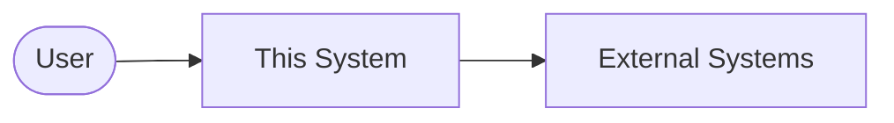

# Architecture Overview

**Status:** TBD - fill before first implementation.

## System context (C4 L1)

_Who/what interacts with the system. A Mermaid diagram is encouraged._

## Container view (C4 L2)

_The major runtime pieces (apps, services, datastores) and how they talk._

## Tech stack

_Languages, frameworks, datastores, cloud - with a one-line justification each. Non-trivial picks
get an ADR._

## Key runtime flows

_The 2-3 most important end-to-end paths through the system._
