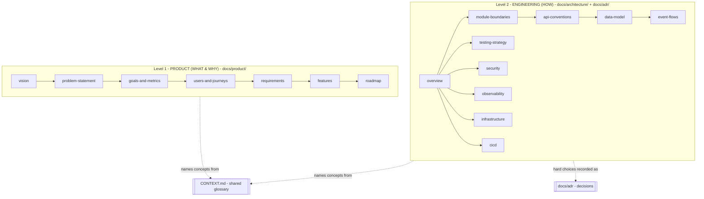
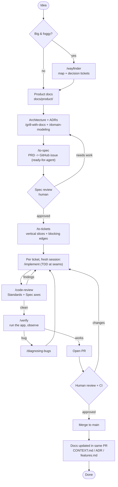
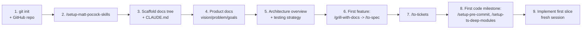
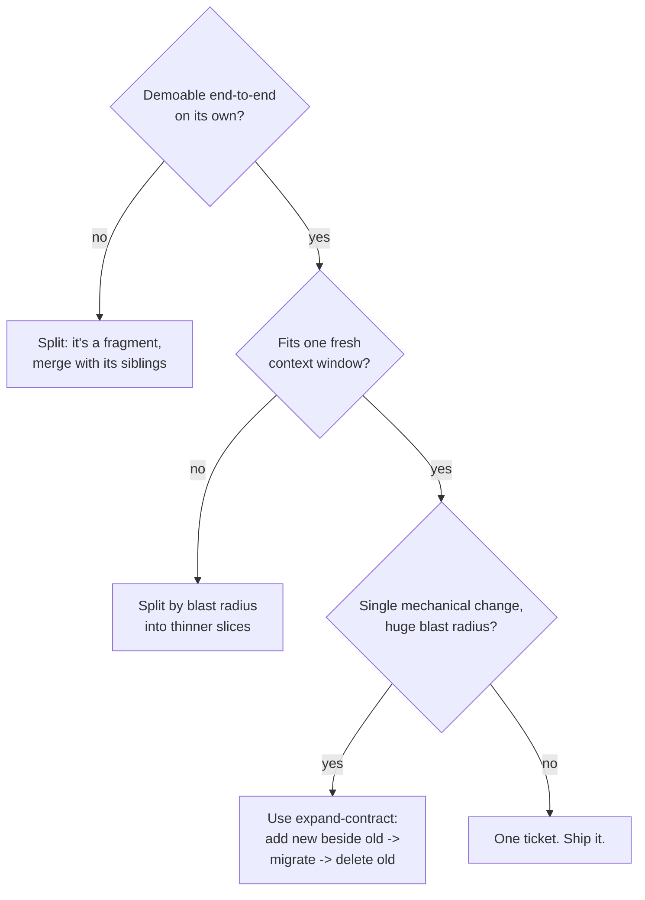
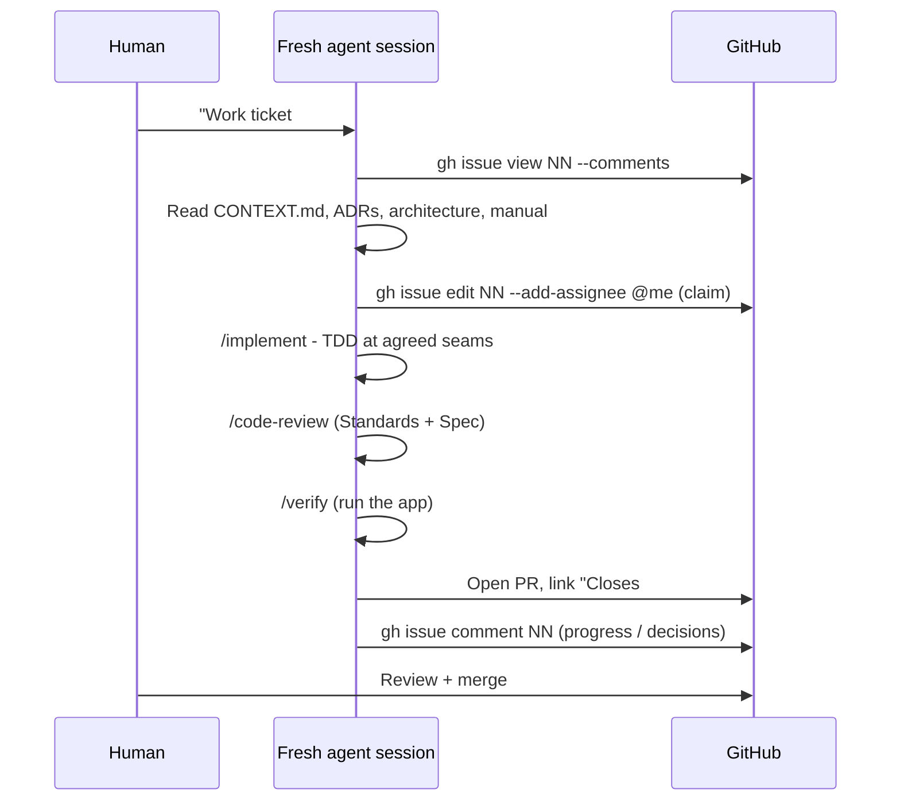
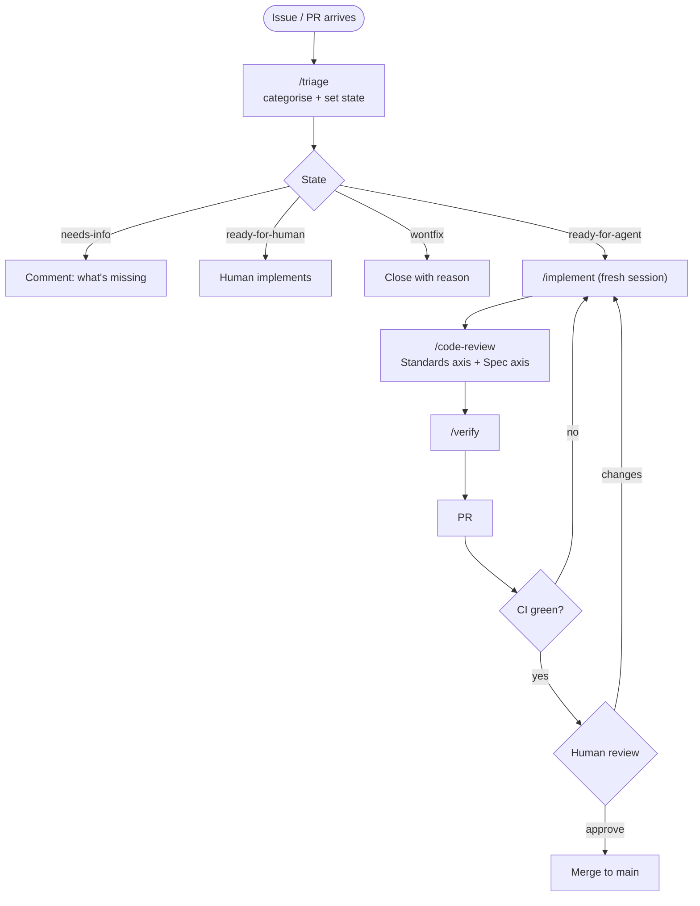

# Operating Manual (SOP)

> The single source of truth for **how this project is built**. If you read only one document before
> contributing - human or AI agent - read this one.
>
> This manual is product-agnostic. It describes the *process*; the *product* is described under
> `docs/product/` and the *architecture* under `docs/architecture/`.

**Contents**

1. [Purpose & how to use this manual](#1-purpose--how-to-use-this-manual)
2. [Operating principles](#2-operating-principles)
3. [Documentation architecture (two levels)](#3-documentation-architecture-two-levels)
4. [The Skills catalogue](#4-the-skills-catalogue)
5. [The end-to-end lifecycle](#5-the-end-to-end-lifecycle)
6. [Project kickoff order](#6-project-kickoff-order)
7. [The AI-agent workflow](#7-the-ai-agent-workflow)
8. [The review workflow](#8-the-review-workflow)
9. [Repository & branch conventions](#9-repository--branch-conventions)
10. [Checklists](#10-checklists)
11. [Anti-patterns & pitfalls](#11-anti-patterns--pitfalls)
12. [Workflow glossary](#12-workflow-glossary)

---

## 1. Purpose & how to use this manual

**Audience:** every contributor. Two kinds of reader:

- **Humans** - to understand the process, decide what to do next, and drive the human-in-the-loop
  (HITL) steps (design conversations, reviews, merges).
- **AI agents** - a fresh Claude Code session should be able to pick up a single unit of work and
  execute it correctly using only: this manual, the GitHub issue it was handed, and the repo's docs
  (`CONTEXT.md`, `docs/adr/`, `docs/architecture/`).

**When to re-read:**

- Before starting a new feature (Sections 5-7).
- Before kicking off a brand-new project or sub-project (Section 6).
- Before every fresh agent session (Section 7 + the per-session checklist in Section 10).
- When a review or merge is due (Section 8).

**How this project works in one paragraph.** We do documentation-first, spec-driven development.
Ideas become product docs, then architecture, then a reviewed **spec** published as a GitHub issue,
then small **vertical-slice tickets**. Each ticket is implemented by an independent, fresh Claude
Code session that reads its issue and the repo docs, writes code test-first, self-reviews, and opens
a PR. A human reviews and merges. Documentation is updated as part of the work, not after it. The
whole loop is powered by a suite of **Skills** installed under `.agents/skills/` (exposed via
`.claude/skills/`).

---

## 2. Operating principles

These are the non-negotiable defaults. Deviating from one is allowed, but it should be a conscious,
recorded decision (usually an ADR).

| # | Principle | What it means in practice |
| - | --------- | ------------------------- |
| P1 | **Documentation-first** | Nothing gets built before the *what/why* (product docs) and the *how* (architecture/spec) are written and reviewed. If it isn't written down, it isn't decided. |
| P2 | **Architecture before feature specs** | The shape of the system (`docs/architecture/`, ADRs) is settled before individual features are specced against it. |
| P3 | **Spec-driven** | Code exists to satisfy a reviewed spec. No spec, no code. The spec lives on the issue tracker as the durable contract. |
| P4 | **Vertical slices** | Work is split into thin, end-to-end slices (schema -> API -> UI -> tests) that are demoable on their own - never horizontal "do all the DB, then all the API" layers. |
| P5 | **One slice per fresh session** | Each ticket is sized to fit in one clean context window and is done by one fresh agent session. Fresh session per ticket keeps context uncontaminated. |
| P6 | **Deep modules** | Prefer a small interface hiding a large implementation. Test through the interface (the *seam*), not around it. Vocabulary: `.agents/skills/codebase-design/`. |
| P7 | **Predictability over cleverness** | Follow the documented process every time. A reviewer (human or agent) should always know what step comes next and what artifact it produces. |
| P8 | **Decisions are durable** | Hard-to-reverse / surprising / trade-off decisions become ADRs. Terminology becomes glossary entries in `CONTEXT.md`. Chat history is not a record. |
| P9 | **Tracer bullets** | Ship the thinnest working path end-to-end first, then thicken it. Prove the architecture with a working slice before scaling out. |

---

## 3. Documentation architecture (two levels)

Documentation is deliberately split into two levels so that "what we are building and why" never
gets tangled with "how we build it".

### Repository structure

| Path | Level | Purpose | Maintained by |
| ---- | ----- | ------- | ------------- |
| `docs/product/` | L1 | Vision, problem, goals, users/journeys, requirements, features, roadmap - the WHAT/WHY | Humans + `/grill-with-docs` |
| `docs/architecture/` | L2 | Overview, module boundaries, API/data/event conventions, testing, security, observability, infra, CI/CD - the HOW | Humans + `/grill-with-docs`, `/domain-modeling` |
| `docs/adr/` | L2 | Architecture Decision Records - one per hard/surprising/trade-off decision | `/domain-modeling` |
| `docs/specs/` | L2 | Optional local mirror of feature PRDs (canonical copy is the GitHub issue) | `/to-spec` (mirror by hand if desired) |
| `docs/agents/` | meta | Machine-facing skill config: issue tracker, triage labels, domain-doc rules | `/setup-matt-pocock-skills` |
| `docs/workflows/` | meta | This manual and any other process docs | Humans |
| `CONTEXT.md` (root) | shared | The domain glossary / ubiquitous language - single source of truth | `/domain-modeling` |
| `CLAUDE.md` (root) | meta | Agent operating instructions + skill config pointers | Humans + `/setup-matt-pocock-skills` |

**Golden rules for docs:**

- **One source of truth per fact.** The glossary lives *only* in `CONTEXT.md`. Product/architecture
  docs link to it; they never redefine a term.
- **Describe the present; record the turning points.** Architecture docs describe how things *are*.
  ADRs record *why* a hard choice was made. Don't turn architecture docs into a changelog.
- **Docs are updated inside the work,** as part of the same PR that changes the behaviour - never as
  a deferred "docs pass".

---

## 4. The Skills catalogue

All skills live under `.agents/skills/<name>/SKILL.md` and are invoked in a Claude Code session by
typing `/<name>` (user-invoked) or by the agent reaching for them autonomously (model-invoked).

**Invocation mode matters:**

- **User-invoked** (`disable-model-invocation: true`) - only a human typing `/<name>` starts it.
  These are the workflow's deliberate control points.
- **Model-invoked** - an agent can fire it on its own when the situation matches its description.

> Run **`/setup-matt-pocock-skills` once per repo before anything else** - the spec/ticket/triage/
> wayfinder skills depend on the config it writes (`docs/agents/*`).

### 4.1 Planning & decisions

| Skill | Invoked | Use when | Input | Output | Usually followed by | Common mistakes | Best practice |
| ----- | ------- | -------- | ----- | ------ | ------------------- | --------------- | ------------- |
| `/wayfinder` | user | A big, foggy effort too large for one session | A loose destination idea | A **map issue** (`wayfinder:map`) + child decision tickets on GitHub | `/research`, `/grill-with-docs`, `/prototype` to resolve tickets; then `/to-spec` | Trying to *execute* while charting; charting and resolving are separate sessions | Chart the map in one session; resolve one ticket per later session |
| `/grilling` | model | You need a plan/design stress-tested before building | A plan or design | A sharpened, mutually-understood plan (conversation) | `/to-spec` or `/to-tickets` | Asking several questions at once | One question at a time; look up facts in the code, get decisions from the human |
| `/grill-with-docs` | user | Design **and** capture decisions/terms at once | A plan or design | Sharpened plan **plus** ADRs + `CONTEXT.md` updates | `/to-spec` | Skipping it and letting decisions live only in chat | Use for every non-trivial design conversation so decisions are captured as they land |
| `/domain-modeling` | model | Pin down terminology or record a decision | Domain terms / a decision | Updated `CONTEXT.md` and/or new ADR(s) | continue design | Coining terms not used by the domain; ADR spam | One-sentence definitions; ADR only when hard-to-reverse/surprising/trade-off |
| `/research` | model | You need facts from primary sources | A question | A cited Markdown findings file in the repo | feeds a decision or spec | Citing blogs over primary sources | Follow every claim to the source that owns it (official docs, source, specs) |
| `/prototype` | model | "Does this state model feel right?" / "What should this look like?" | A design question | Throwaway prototype on its own branch + the answer captured on the issue | fold the answer into the real spec/code | Letting the prototype become the real code | Throwaway from day one; capture the decision, discard the code |
| `/ubiquitous-language` | user | *(Deprecated)* | - | `UBIQUITOUS_LANGUAGE.md` | - | Using it at all | Prefer `/domain-modeling` -> `CONTEXT.md` |

### 4.2 Spec -> work

| Skill | Invoked | Use when | Input | Output | Usually followed by | Common mistakes | Best practice |
| ----- | ------- | -------- | ----- | ------ | ------------------- | --------------- | ------------- |
| `/to-spec` | user | A feature's design is settled and needs a formal PRD | The design conversation + `CONTEXT.md` + ADRs | A **spec/PRD GitHub issue**, labelled `ready-for-agent`, with test seams | human spec review, then `/to-tickets` | Writing a spec with no test seams; specifying while still undecided | Grill first (`/grill-with-docs`); to-spec is synthesis, not interviewing |
| `/to-tickets` | user | A spec must be broken into buildable slices | A spec / plan / conversation | **Vertical-slice tickets** with blocking edges, labelled `ready-for-agent` | `/implement` per ticket | Horizontal (layer-shaped) tickets; slices too big for one context | Each slice cuts through every layer, is demoable, fits one session; size by blast radius |
| `/triage` | user | Incoming issues/PRs need sorting and agent-ready briefs | Issue/PR numbers or a query | Labelled issues + agent briefs / needs-info notes | `/implement` for `ready-for-agent` items | Marking under-specified issues `ready-for-agent` | Verify the claim (reproduce) and grill before promoting to `ready-for-agent` |

### 4.3 Build & verify

| Skill | Invoked | Use when | Input | Output | Usually followed by | Common mistakes | Best practice |
| ----- | ------- | -------- | ----- | ------ | ------------------- | --------------- | ------------- |
| `/implement` | user | A `ready-for-agent` ticket must be built | A ticket / spec | Implemented, tested, self-reviewed code on a branch | `/code-review`, `/verify`, PR | Building beyond the ticket's scope; skipping tests | TDD at the agreed seams; typecheck + run tests continuously; full suite at the end |
| `/code-review` | model | Reviewing a branch/PR/WIP | A fixed point (commit/branch/tag) + optional spec | A two-axis report: **Standards** and **Spec** | fix findings, then merge | Merging without the spec axis | Point it at both the coding standards and the originating spec |
| `/diagnosing-bugs` | model | Something is broken/slow | A bug report | Fix + a regression test at the correct seam | `/code-review` | Fixing before reproducing | Build a red feedback loop first; test the real bug pattern before fixing |
| `/improve-codebase-architecture` | user | Hunting for shallow modules to deepen | The codebase | Interactive HTML report + a grilled improvement + ADR/`CONTEXT.md` updates | `/to-tickets` for the chosen change | Refactoring without a decision | Use the deletion test; grill the chosen candidate before touching code |
| `/codebase-design` | model | Designing/evaluating a module interface | A module | A deepened interface (vocabulary + method) | `/implement` | Layering instead of deepening | "Two adapters make a real seam"; interface is the test surface |

### 4.4 Infra / setup

| Skill | Invoked | Use when | Input | Output | Notes |
| ----- | ------- | -------- | ----- | ------ | ----- |
| `/setup-matt-pocock-skills` | user | **First**, once per repo | Tracker + label + domain-layout choices | `docs/agents/*` + `## Agent skills` block in `CLAUDE.md` | Prerequisite for `/to-spec`, `/to-tickets`, `/triage`, `/wayfinder` |
| `/setup-pre-commit` | model | After `package.json` exists | A Node project | Husky + lint-staged (format/typecheck/test on commit) | Run at the "first code" milestone |
| `/setup-ts-deep-modules` | user | TypeScript repo wanting enforced boundaries | A TS package structure | dependency-cruiser config + `lint:boundaries` | Enforces P6 mechanically |

### 4.5 Cross-session

| Skill | Invoked | Use when | Input | Output | Best practice |
| ----- | ------- | -------- | ----- | ------ | ------------- |
| `/handoff` | user | A session must continue later in a fresh one | Current conversation (+ optional focus) | A handoff doc in the OS temp dir, path returned | Reference artifacts by path/URL; don't duplicate specs/diffs; redact secrets |

---

## 5. The end-to-end lifecycle

This is the **default** path from idea to production. Not every feature needs every step (see the
decision points), but the ordering is fixed.

**Decision points on the path:**

- **Foggy?** If you cannot yet name the destination or the path has unknowns, start with
  `/wayfinder`. If the feature is well understood, skip straight to product docs.
- **New architecture needed?** If the feature fits the existing architecture, skip to `/to-spec`.
  If it introduces a new module boundary, datastore, or cross-cutting concern, do the
  `/grill-with-docs` architecture pass and record ADRs first.
- **ADR or not?** Only decisions that are hard to reverse, surprising, or a genuine trade-off earn
  an ADR. Everything else just updates the architecture docs.

---

## 6. Project kickoff order

The exact order for standing up a brand-new project (or a major new sub-project). Do not reorder -
later steps depend on earlier ones.

**Answers to the standard kickoff questions:**

- **Which documents first?** In order: `docs/product/{vision, problem-statement, goals-and-metrics}`
  -> `docs/architecture/{overview, testing-strategy}` -> the first feature spec. You do not need the
  entire product catalogue before starting; you need enough to make the first architecture and spec
  honest.
- **Architecture before feature specs?** Yes (P2). The first spec is written *against* an agreed
  overview and testing strategy.
- **ADRs before implementation?** Only for decisions that clear the ADR bar (hard-to-reverse /
  surprising / trade-off). Do not manufacture ADRs to look thorough; do not start implementing a
  decision that clears the bar without one.
- **When `/grill-with-docs` vs `/to-spec`?** Grill first - it is the *design and decision* step.
  `/to-spec` comes after, to *formalize* a settled design. Never run `/to-spec` on an undecided
  design.
- **When is `/setup-*` used?** `/setup-matt-pocock-skills` at step 2 (before any spec/ticket work).
  `/setup-pre-commit` and `/setup-ts-deep-modules` at the first-code milestone (they need a
  `package.json`).
- **What is always generated (never hand-written)?** Specs (`/to-spec`), tickets (`/to-tickets`),
  and the `docs/agents/*` config (`/setup-matt-pocock-skills`) - so structure and labels stay
  consistent.
- **What is always human-reviewed?** Every spec before it becomes tickets; every PR before merge;
  every ADR.
- **What must never be skipped?** `/setup-matt-pocock-skills` first; the spec review; test seams in
  the spec; `/code-review` before merge; the docs update inside the same PR.

---

## 7. The AI-agent workflow

The project runs on **independent, fresh Claude Code sessions**. This section is how to make that
reliable.

### 7.1 How work is split

Work is split into **vertical slices** (P4) via `/to-tickets`:

- Each slice cuts a **narrow but complete** path through every layer (schema -> API -> UI -> tests).
- A completed slice is **demoable/verifiable on its own**.
- Each slice is sized to fit in **one fresh context window** - size by *blast radius*, not by layer.
- Slices declare **blocking edges** so agents pick unblocked work.

**"Is this one slice or many?" decision tree:**

### 7.2 How context is provided to an agent

An agent session starts **cold**. Everything it needs must be reachable from the ticket:

1. **The GitHub issue** is the agent's brief - self-contained: what to build (user-visible
   behaviour), acceptance criteria, blocking edges, and the test seams from the spec.
2. **The repo docs** it reads before touching code: `CONTEXT.md` (glossary), relevant `docs/adr/`,
   the pertinent `docs/architecture/` files, and this manual. `CLAUDE.md` points the way.
3. **Nothing from a prior chat.** If it isn't in the issue or the repo, the agent doesn't know it.
   That is by design - it keeps sessions independent and reproducible.

### 7.3 How an agent works a ticket

### 7.4 Progress, review, validation, merge

- **Progress reporting:** agents report on the **issue/PR**, not in ephemeral chat - a comment when
  claiming, a comment for any decision or scope question, the PR when done.
- **Review:** `/code-review` (agent self-review, two axes) then a **human** PR review + green CI.
- **Validation:** `/verify` runs the real app and observes the behaviour the ticket promised.
- **Merge:** a **human** merges to `main`. The PR must update docs (`CONTEXT.md`/ADR/`features.md`)
  in the same change.

### 7.5 Avoiding context pollution

This is the highest-leverage discipline in the whole workflow.

- **One ticket per session, fresh session per ticket.** Never work two tickets in one thread.
- **Never carry a bloated design thread into implementation.** Capture the design as a spec/ADR/
  glossary entry, then start a clean session pointed at the artifact.
- **Use `/handoff`** when a single unit of work genuinely must continue later - it writes a compact
  handoff doc that references artifacts by path, instead of dragging the whole transcript along.
- **Prefer artifacts over memory.** A decision that matters goes into `CONTEXT.md`, an ADR, or the
  issue - not into the hope that the next session remembers the conversation.

---

## 8. The review workflow

Every unit of work passes through the same gates. Nothing reaches `main` without them.

**Triage states** (from `docs/agents/triage-labels.md`):

| State | Meaning | Next |
| ----- | ------- | ---- |
| `needs-triage` | Not yet evaluated | Triage it |
| `needs-info` | Waiting on reporter | Reporter responds |
| `ready-for-agent` | Fully specified, agent can build AFK | `/implement` |
| `ready-for-human` | Needs a human | Human implements |
| `wontfix` | Won't be actioned | Close |

**`/code-review` two axes:**

- **Standards** - does the code follow this repo's documented coding standards + a fixed code-smell
  baseline?
- **Spec** - does the code do what the originating spec/issue actually asked for?

Both axes must be clean (or findings consciously accepted) before human review.

---

## 9. Repository & branch conventions

- **Default branch:** `main`. Protected: PR + green CI required to merge.
- **Branch naming:** `<type>/<issue#>-<slug>`, e.g. `feat/42-patient-search`,
  `fix/57-null-dob-crash`. Types: `feat`, `fix`, `chore`, `refactor`, `docs`.
- **One branch per ticket.** The branch closes exactly one `ready-for-agent` ticket.
- **Commits:** imperative subject, reference the issue (`#NN`). **Do not add an AI co-author line**
  (project rule). No em dashes in messages (use `-`).
- **PRs:** title references the issue; body has "Closes #NN", a short what/why, and a checklist of
  the acceptance criteria. PR includes the docs update.
- **CI gates (see `docs/architecture/cicd.md`):** typecheck, lint, `lint:boundaries` (once TS deep
  modules are set up), unit + integration tests. All green before merge.

### Definition of Done

A ticket is done when **all** of:

- [ ] Acceptance criteria in the issue are met.
- [ ] Behaviour is covered by tests at the correct seam; full suite green.
- [ ] `/code-review` Standards + Spec axes clean (or findings consciously accepted).
- [ ] `/verify` confirms the behaviour in the running app (for user-facing work).
- [ ] Docs updated in the same PR: `CONTEXT.md` / ADR / `docs/architecture/*` / `features.md` as
      applicable.
- [ ] CI green; human-reviewed; merged to `main`; issue closed.

---

## 10. Checklists

### 10.1 Project kickoff checklist

- [ ] `git init`, `.gitignore`, GitHub repo + remote created.
- [ ] `/setup-matt-pocock-skills` run (tracker = GitHub, default triage labels, single-context).
- [ ] Triage labels created on GitHub.
- [ ] `docs/` tree scaffolded; `CONTEXT.md` and `CLAUDE.md` present.
- [ ] `docs/product/{vision, problem-statement, goals-and-metrics}` drafted.
- [ ] `docs/architecture/{overview, testing-strategy}` drafted.
- [ ] First feature designed via `/grill-with-docs`, specced via `/to-spec`.
- [ ] Initial commit made (no AI co-author line).

### 10.2 Per-feature checklist

- [ ] (If foggy) `/wayfinder` map created and decisions resolved.
- [ ] Product docs updated (`requirements.md`, `features.md`).
- [ ] Architecture pass done + ADRs recorded where the bar is met.
- [ ] `/grill-with-docs` design conversation held.
- [ ] `/to-spec` PRD issue created, labelled `ready-for-agent`, with test seams.
- [ ] Spec **human-reviewed**.
- [ ] `/to-tickets` vertical slices created with blocking edges.

### 10.3 Per-agent-session checklist

- [ ] Fresh session; exactly one ticket.
- [ ] `gh issue view <NN> --comments` read in full.
- [ ] `CONTEXT.md`, relevant ADRs, relevant `docs/architecture/*`, this manual read.
- [ ] Ticket claimed (`gh issue edit <NN> --add-assignee @me`).
- [ ] `/implement` with TDD at the agreed seams.
- [ ] `/code-review` (both axes) + `/verify`.
- [ ] Branch pushed, PR opened ("Closes #NN"), docs updated in the PR.
- [ ] If continuing later: `/handoff` instead of reusing the thread.

### 10.4 Pre-merge checklist

See [Definition of Done](#definition-of-done). All boxes ticked -> a human merges.

---

## 11. Anti-patterns & pitfalls

| Anti-pattern | Why it hurts | Do instead |
| ------------ | ------------ | ---------- |
| Skipping `/setup-matt-pocock-skills` | `/to-spec`, `/to-tickets`, `/triage`, `/wayfinder` don't know where the tracker is | Run it first, once |
| Writing code before a reviewed spec | Builds the wrong thing; no contract to review against | Spec-driven (P3): no spec, no code |
| Horizontal tickets ("all the DB", "all the API") | Nothing is demoable until everything is done; giant risky merges | Vertical slices (P4) |
| Tickets too big for one context window | Session runs out of context, quality collapses mid-task | Size by blast radius; split |
| Working multiple tickets in one session | Context pollution; decisions from ticket A leak into B | One ticket per fresh session (P5) |
| Carrying a giant design thread into implementation | Stale, noisy context; the agent optimizes for the chat, not the artifact | Capture design in spec/ADR, start clean |
| Decisions that live only in chat | Lost the moment the session ends | ADR + `CONTEXT.md` (P8) |
| ADR sprawl (an ADR for every choice) | Signal drowns in noise | ADR only for hard/surprising/trade-off |
| Duplicating the glossary into product docs | Definitions drift out of sync | Link to `CONTEXT.md`; one source of truth |
| `/to-spec` on an undecided design | Formalizes confusion | `/grill-with-docs` first, then `/to-spec` |
| Specs without test seams | Agents guess where to test; brittle tests | Confirm seams in the spec (P6) |
| Merging on the Standards axis alone | Clean code that does the wrong thing | Require the Spec axis too |
| Fixing a bug before reproducing it | Fixes the symptom, not the cause | `/diagnosing-bugs`: red loop first |
| Prototype code becoming production code | Ships throwaway quality | Capture the decision; discard the prototype |
| Deferred "docs later" pass | Docs never catch up; drift compounds | Update docs inside the same PR |

---

## 12. Workflow glossary

Terms used throughout this manual (distinct from the *domain* glossary in `CONTEXT.md`).

| Term | Meaning |
| ---- | ------- |
| **Spec / PRD** | The reviewed contract for a feature, published as a GitHub issue by `/to-spec`. |
| **Ticket** | A vertical-slice unit of buildable work created by `/to-tickets`. |
| **Vertical slice** | A narrow but complete path through every layer, demoable on its own. |
| **Tracer bullet** | The thinnest working end-to-end path, shipped first to prove the architecture. |
| **Seam** | The place a module's interface lives - where you test through, and where adapters plug in. |
| **Deep module** | A small interface hiding a large implementation (high leverage per unit of interface). |
| **Blast radius** | How much of the system a change touches; the sizing unit for slices. |
| **Fog of war** | The set of not-yet-sharp questions in a `/wayfinder` map; graduates into tickets one at a time. |
| **Map** | A single `/wayfinder` issue holding a big effort's decisions and open questions. |
| **Agent brief** | A self-contained issue an agent can build from cold, with no prior chat context. |
| **AFK** | "Away from keyboard" - work an agent can complete unattended (a `ready-for-agent` ticket). |
| **HITL** | "Human in the loop" - a step that requires a person (design, review, merge). |
| **ADR** | Architecture Decision Record - one durable, hard/surprising/trade-off decision. |
| **Ubiquitous language** | The shared, canonical domain vocabulary kept in `CONTEXT.md`. |
| **Handoff** | A compact doc (`/handoff`) that lets a fresh session continue a unit of work. |

---

_This manual is itself a living document. When the process changes, change the manual in the same PR
that changes the process - and, if the change is a real trade-off, record an ADR for it._
